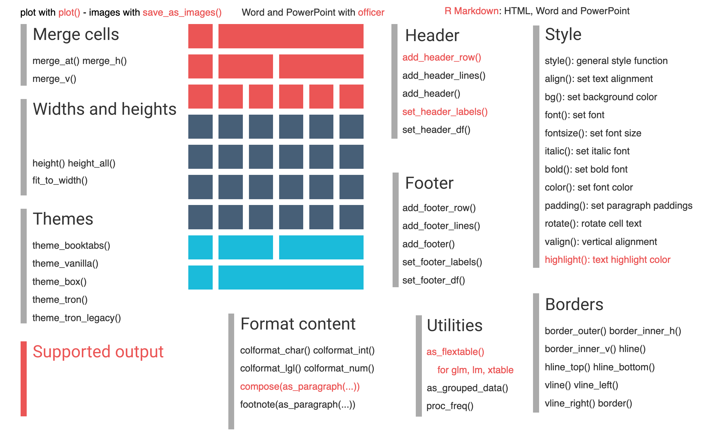

```{r include = F}

# This is the recommended set up for flipbooks
# you might think about setting cache to TRUE as you gain practice --- building flipbooks from scratch can be time consuming
knitr::opts_chunk$set(fig.width = 6, message = FALSE, warning = FALSE, comment = "", cache = F)
library(flipbookr)
library(officer)
library(tidyverse)
```


# Data Tabulation

- Table Type

  - frequency table

  - cross table
  
  - summary table
  
  - test table(T, chi, anovo)
  
  - regression table


```{r xaringan-tile-view, echo=FALSE}
xaringanExtra::use_tile_view()
```


---

# Tabulation packages

- Table creation: .red[**base**], sjmics, sjplot, table1, .red[**gtsummary**], .red[**rstatix**]

- Table formatting: gt, formattable, kable, [kableExtra](https://cran.r-project.org/web/packages/kableExtra/vignettes/awesome_table_in_html.html#Overview), .red[**flextable**]

- Responsive table: [reactable](https://glin.github.io/reactable/index.html), .red[**DT**]

.footnote[**Bold** packages will be taught in class]


---
class: reverse
# base package

`r chunk_reveal("basetable")`

```{r basetable, include=FALSE}

head(mtcars)
table(mtcars$cyl)
table(mtcars$cyl,mtcars$vs)
summary(mtcars$mpg)
```


---
class: middle, inverse

# [rstatix](https://rpkgs.datanovia.com/rstatix/index.html)

- ## get_summary_stats()

- ## freq_table()

---
class: inverse

`r chunk_reveal("rstatixtable", widths = c(60,40))`

```{r rstatixtable, include=FALSE}

library(rstatix)
data("ToothGrowth")
ToothGrowth %>% 
  get_summary_stats(len) 
ToothGrowth %>% #ROTATE
  get_summary_stats(len, type = "robust")
ToothGrowth %>% #ROTATE
  get_summary_stats(len, type = "five_number") 
ToothGrowth %>% #ROTATE
  get_summary_stats(len, type = "mean_sd") 
ToothGrowth %>% #ROTATE
  get_summary_stats(len,dose, show = c("mean","sd", "median","iqr")) #ROTATE

ToothGrowth %>% 
  freq_table(supp, dose)
```

---

# [flextable](https://davidgohel.github.io/flextable/)





---

`r chunk_reveal("flextable", widths = c(60,40))`

```{r flextable, include=FALSE}

library(rio)
library(flextable)

#student <- import("/sampledata/student_sample.dta") # does not work in R and R markdown
#student <- import("../sampledata/student_sample.dta") #work in R markdown not in R file
library(here)
student <- import(here("sampledata","student_sample.dta"))  #work in R and R markdown file
#student <- import("/Users/yangyongye/R/pptgit/sampledata/student_sample.dta") # work in both R and R markdown file

score_summary <- student %>% 
  drop_na(w2chn, w2mat, w2eng) %>%
  get_summary_stats(w2chn,
                    w2mat, w2eng, 
                    type = "common")

score_summary %>%
  flextable(col_keys = c(
    "variable","n","min","max","mean","sd")) %>%
  set_header_labels(variable="变量", n="数量",
                    min="最小值",max="最大值",
                    mean="均值",sd="标准差") %>% 
  bold(bold = T, part="header") %>%
  bg(bg="grey80",part = "header") %>%
  color(i=3, j=4,color = "red") %>% 
  width(j=3, width = 0.7) %>% 
  hrule(rule = "exact") %>%
  height(i=2, height = 0.4) %>%
  colformat_num(j=4:6, digits=1) %>% 
  set_caption(caption = "初中生期中语数外成绩统计表") %>% 
  footnote(i=1,j=2,
           value=as_paragraph("包括七年级、九年级学生"),
           ref_symbols = "a",
           part="header")
```


---
# [gtsummary](http://www.danieldsjoberg.com/gtsummary/articles/tbl_summary.html)

--

- ## tbl_summary()

--

- ## tbl_cross()

---

`r chunk_reveal("gtsummarytable", widths = c(50,50))`

```{r gtsummarytable, include=FALSE}
library(gtsummary)
library(gt)
library(dplyr)

trial %>% 
  select(trt,age,grade) %>% 
  tbl_summary(by = trt) %>%
  add_p(pvalue_fun = ~style_pvalue(.x, digits = 2)) %>%
  add_overall() %>%
  add_n() %>%
  modify_header(label ~ "**Variable**") %>%
  modify_spanning_header(
    c("stat_1","stat_2") ~ "**Treatment Received**") %>%
  modify_footnote(
    starts_with("stat_") ~ "Median (IQR) or Frequency (%)"
  ) %>%
  bold_labels()
```


---

# [DT](https://rstudio.github.io/DT/)

```{r,message=FALSE}
library(DT)
mtcars %>% 
  select(mpg, cyl, disp, hp, drat, wt) %>% datatable()
```

---
# Practice 

- 做一个频数表，性别，户口，家庭经济条件

- 做一个交叉表，恋爱与否与家庭经济条件

- 做一个统计表，身高，体重

---
class: inverse

# NEXT WEEK

- ## R Graphics Cookbook, [Chapter 2-6](https://r-graphics.org) (required)

- ## An Introduction R [Chapter 4](https://intro2r.com/graphics-base-r.html) (optional)

- ## ggplot2:  Elegant Graphics for Data Analysis [Chapter 1-11](https://ggplot2-book.org/) (optional)

- ## R4DS [Chapter 17-21](https://r4ds.had.co.nz/program-intro.html) (optional)

---
# package installation for Next week

- gcookbook, ggridges, ggrepel, ggthemes

- viridis, RColorBrewer, colorspace

- gganimate, patchwork.
